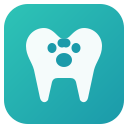

# DentaVet

**Veterinary dental charting made simple.**

A Chrome extension for recording dental findings in dogs and cats using the Modified Triadan System — with direct EzyVet integration.

[Get it on the Chrome Web Store](#) &nbsp;|&nbsp; [Privacy Policy](privacy-policy.html)

---

## What is DentaVet?

DentaVet is a professional dental charting tool built for veterinarians and veterinary nurses. It runs as a Chrome side panel alongside EzyVet, letting you chart findings in real time during dental procedures — then push everything to the patient record with one click.

No more scribbling on paper charts. No more typing up notes after the fact.

---

## Key Features

- **Interactive dental chart** — clickable SVG chart for adult dogs (42 teeth) and cats (30 teeth)
- **Colour-coded severity** — teeth change colour based on findings (normal, mild, moderate, severe, extracted)
- **Comprehensive findings** — periodontal disease staging (PD0–PD4), tooth resorption (TR1–TR5), fracture classification, furcation grades, mobility grades, and probing depths
- **Extraction & procedures** — record simple/surgical extractions, scaling, root planing, gingival curettage, and flap surgery
- **Multi-tooth selection** — shift+click or drag-select to apply findings to multiple teeth at once
- **EzyVet integration** — auto-scan patient details, push chart findings directly to EzyVet dental records, and generate formatted reports
- **Keyboard shortcuts** — fast charting with hotkeys for every finding type
- **Export & import** — save and load charts as JSON for record keeping
- **100% local** — all data stays in your browser. Nothing is sent to external servers.

---

## How It Works

1. Open EzyVet in Chrome and navigate to your patient
2. Click the DentaVet icon to open the side panel
3. Patient details are scanned automatically
4. Click teeth to record findings — periodontal disease, resorption, fractures, extractions, and more
5. Push your chart to EzyVet or generate a formatted report

---

## Pricing

**R1,999 once-off** (approx. $99 USD) per licence key.

Each licence allows activation on up to **2 devices** — so you can use it at work and at home, or across two workstations in your clinic. Licences can be deactivated and moved to new devices at any time.

**14-day free trial included** — no credit card required.

[Purchase a licence key](https://dentavet.lemonsqueezy.com)

---

## Screenshots

*Interactive dental chart with colour-coded findings*

*Comprehensive findings panel with one-click recording*

*Formatted reports ready for patient records*

---

## Installation

1. Visit the [Chrome Web Store listing](#)
2. Click **Add to Chrome**
3. Open EzyVet and click the DentaVet icon in your toolbar
4. Start your 14-day free trial or enter your licence key

---

## Support

For questions, feedback, or support:

**Dr. Andrew Rissik**
andrewrissik@gmail.com

---

Made with care for the veterinary community.

